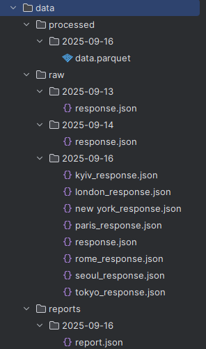
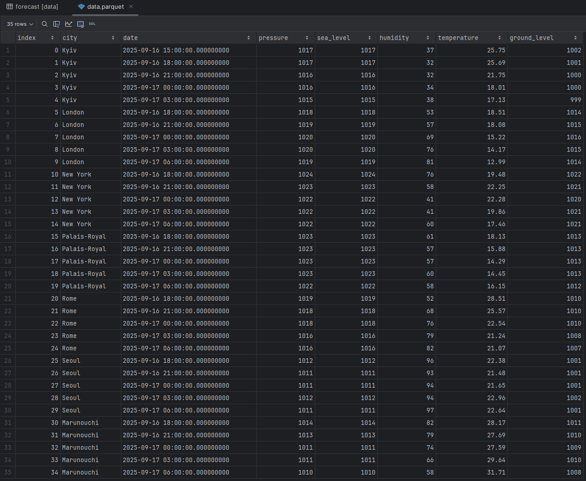

# CHI Test Project

A weather data processing application that supports both SQLite and PostgreSQL databases.

## API Used

This application uses the **OpenWeatherMap API** to fetch weather forecast data:
- **Geolocation API**: `/geo/1.0/direct` - Get coordinates for city names
- **5-Day Weather Forecast API**: `/data/2.5/forecast` - Get 5-day weather forecast data
- **API Documentation**: [OpenWeatherMap API Docs](https://openweathermap.org/api)

## Fields Selected and Processed

The application processes the following weather data fields from the OpenWeatherMap API:

### Raw API Fields (from `main` object):
- `temp` → `temperature` (renamed)
- `pressure` (atmospheric pressure)
- `sea_level` (sea level pressure)
- `grnd_level` → `ground_level` (renamed)
- `humidity` (relative humidity percentage)
- `dt` → `date` (timestamp converted to datetime)

### Fields Excluded:
- `feels_like` (removed during processing)
- `temp_min` (removed during processing)
- `temp_max` (removed during processing)
- `temp_kf` (removed during processing)

### Additional Fields Added:
- `city` (city name from geolocation data)

### Final Database Schema:
- `id` (primary key, auto-generated)
- `city` (string, 40 characters)
- `date` (datetime)
- `temperature` (float, in Celsius)
- `pressure` (integer, atmospheric pressure in hPa)
- `sea_level` (integer, sea level pressure in hPa)
- `humidity` (integer, relative humidity %)
- `ground_level` (integer, ground level pressure in hPa)

## Project Initialization

This project uses `uv` for dependency management. To initialize and run the project:

1. Install project dependencies:
   ```bash
   uv sync
   ```

2. Get your OpenWeatherMap API key:
   - Go to [OpenWeatherMap API](https://openweathermap.org/api)
   - Sign up for a free account
   - Navigate to your API keys section
   - Copy your API key
<br><br>
3. Create a `.env` file with your configuration:
   
   **On Windows (PowerShell):**
   ```powershell
   New-Item -Path .env -ItemType File
   ```
   
   **On macOS/Linux:**
   ```bash
   touch .env
   ```
   
   Edit the `.env` file to set your API key and database preferences:
   ```
   # API Configuration
   API_KEY=your_actual_api_key_from_openweathermap
   
   # Database Configuration
   # Set to 'sqlite' for SQLite or 'postgres' for PostgreSQL
   DATABASE_TYPE=sqlite
   
   # PostgreSQL Configuration (only used when DATABASE_TYPE=postgres)
   POSTGRES_HOST=localhost
   POSTGRES_PORT=5432
   POSTGRES_DB=db
   POSTGRES_USER=gaster
   POSTGRES_PASSWORD=admin
   ```

4. Run database migrations (required before first run):
   ```bash
   uv run alembic upgrade head
   ```

5. Run the application:
   ```bash
   uv run python -m src.main
   ```

6. **Results Storage:**
   The application stores results in two locations:
   - **Data folder**: Processed data files are saved in the `data/` directory
     - `data/raw/` - Raw API responses
     - `data/processed/` - Processed data files (Parquet format)
     - `data/reports/` - Generated reports
   - **Database**: Weather forecast data is stored in the configured database
     - SQLite: `data.db` file
     - PostgreSQL: `forecast` table in the configured database

## Program Demonstration

The following screenshots demonstrate that the program works correctly:

<details>
<summary><b>Raw API Responses and Generated Reports</b></summary>


*Raw API responses stored in JSON format and generated analysis reports*

</details>

<details>
<summary><b>Processed Data in Parquet Format</b></summary>


*Weather forecast data processed and stored in efficient Parquet format*

</details>

<details>
<summary><b>Database Storage</b></summary>


*Weather forecast data stored in the database with proper schema and relationships*

</details>

## Prefect Workflow Orchestration

This project uses **Prefect** for workflow orchestration, providing:

### Features
- **Task Caching**: API calls are cached for 1 hour to avoid redundant requests
- **Retry Logic**: Automatic retries with exponential backoff for failed tasks
- **Error Handling**: Comprehensive error handling and logging
- **Monitoring**: Built-in flow monitoring and observability
- **Manual Execution**: On-demand flow execution with visual graph
- **City-Specific Tasks**: Clear task identification in the flow graph

### Prefect Commands

**Option 1: Run Flow Directly (Recommended for Development)**
```bash
# Run the flow directly with all Prefect features
uv run python -m src.main
```

**Option 2: Full Server + Worker + Deployment Setup**

**Step 1: Start Prefect Server**
```bash
# Start Prefect server (keep this running)
uv run prefect server start
```

**Step 2: Start Worker (in new terminal)**

**On Windows (Command Prompt):**
```cmd
set PREFECT_API_URL=http://127.0.0.1:4200/api
uv run prefect worker start --pool "local-process-pool"
```

**On Windows (PowerShell):**
```powershell
$env:PREFECT_API_URL="http://127.0.0.1:4200/api"
uv run prefect worker start --pool "local-process-pool"
```

**On Linux/macOS:**
```bash
export PREFECT_API_URL=http://127.0.0.1:4200/api
uv run prefect worker start --pool "local-process-pool"
```

**Step 3: Deploy Flows**
```bash
# Deploy flows using prefect.yaml configuration
uv run prefect deploy --all
```

**Step 4: Run Deployed Flows**
```bash
# Run manual deployment
uv run prefect deployment run "weather-data-pipeline/weather-pipeline-manual"
```

**Monitor Flows:**
```bash
# View flow runs
uv run prefect flow-run ls

# View specific flow run details
uv run prefect flow-run inspect <flow-run-id>

# Access Prefect UI
# Go to http://localhost:4200
```

### Workflow Structure

The Prefect workflow consists of these tasks:

1. **`acquire_weather_data`** - Fetches weather data from OpenWeatherMap API
   - Cached for 1 hour to avoid redundant API calls
   - 3 retries with 60-second delays
   
2. **`process_weather_data`** - Processes raw API data into structured format
   - Converts timestamps to datetime objects
   - Handles data cleaning and transformation
   
3. **`save_to_database`** - Saves processed data to database
   - Supports both SQLite and PostgreSQL
   - Handles duplicate detection
   
4. **`generate_analysis_report`** - Creates analysis reports
   - Calculates average temperatures
   - Generates city-specific statistics

### Flow Configuration

The workflow is configured in `prefect.yaml` with:
- **Manual execution**: On-demand only
- **Error handling**: Automatic retries and logging
- **Caching**: 1-hour cache for API calls
- **City-specific task names**: Easy identification in the flow graph
- **Database flexibility**: Uses environment variables to determine database type

## Database Setup

This project supports both SQLite and PostgreSQL databases.

### SQLite (Default)

SQLite is the default database and requires no additional setup. The database file will be created automatically at `data.db`.

### PostgreSQL Setup

1. Start the PostgreSQL container:
   ```bash
   docker-compose up -d
   ```

2. Set environment variables for PostgreSQL:
   ```bash
   export DATABASE_TYPE=postgresql
   export POSTGRES_HOST=localhost
   export POSTGRES_PORT=5432
   export POSTGRES_DB=db
   export POSTGRES_USER=gaster
   export POSTGRES_PASSWORD=admin
   ```

3. Run database migrations:
   ```bash
   uv run alembic upgrade head
   ```

## Environment Variables

| Variable            | Default     | Description                             |
|---------------------|-------------|-----------------------------------------|
| `DATABASE_TYPE`     | `sqlite`    | Database type: `sqlite` or `postgres`   |
| `POSTGRES_HOST`     | `localhost` | PostgreSQL host                         |
| `POSTGRES_PORT`     | `5432`      | PostgreSQL port                         |
| `POSTGRES_DB`       | `db`        | PostgreSQL database name                |
| `POSTGRES_USER`     | `gaster`    | PostgreSQL username                     |
| `POSTGRES_PASSWORD` | `admin`     | PostgreSQL password                     |
